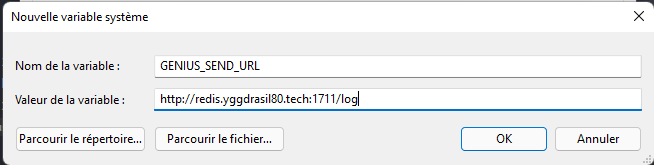
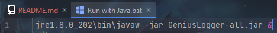
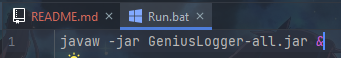

<h1 align="center" style="display: block; font-size: 2.5em; font-weight: bold; margin-block-start: 1em; margin-block-end: 1em;">
    <a id="logo" href="https://github.com/Yggdrasil80/GeniusLogger"></a>
    <br><br>
    <strong>GeniusLogger</strong>
</h1>

---

## Project Status[](#project-status)
<table class="no-border">
  <tr>
    <td></td>
    <td></td>
    <td></td>
  </tr>
</table>

---

## Introduction[](#introduction)
**GeniusLogger** is an open-source and light KeyLogger, written in Java, and working with his [API](https://github.com/Yggdrasil80/GeniusAPI).

---

## Table of contents[](#table-of-contents)
1. [How to use](#how-to-use)
2. [Advanced usage](#advanced-usage)

---

## How to use[](#how-to-use)
- First, you need to set the ```GENIUS_SEND_URL``` variable in your Path (```http://redis.yggdrasil80.tech/log``` by default, check the [API Documentation](https://github.com/Yggdrasil80/GeniusAPI#how-to-use) to learn more).\

- Next, you can run ```java -jar GeniusLogger-all.jar```, and type something, there is no output by default.

---

## Advanced usage[](#advanced-usage)
- You can use the [with or without java packaged](https://github.com/Yggdrasil80/GeniusLogger/releases) release, depending on your environment.
- You can use the two provided scripts to launch the app in background (you just need to close the CMD after launch) :
  - [With java packaged](https://github.com/Yggdrasil80/GeniusLogger/blob/master/Run%20with%20Java.bat) script :\
  
  - [Without java packaged](https://github.com/Yggdrasil80/GeniusLogger/blob/master/Run.bat) script :\
  
- You can set the sending delay by creating a ```GENIUS_SEND_DELAY``` variable in your Path, and set the delay (in seconds). Its 60s by default.